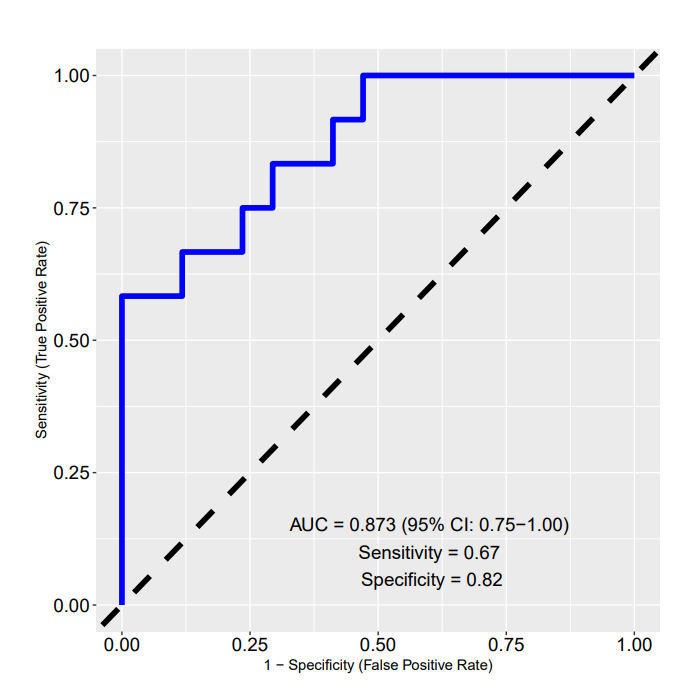
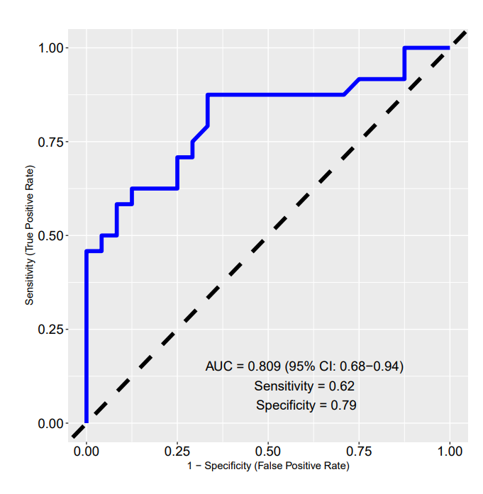

ML-driven ROC pipeline for classification and visualization

This repository provides a streamlined and user-friendly pipeline for performing classification, model evaluation, and visualization using the caret and h2o machine learning frameworks. This workflow automates data preprocessing, model training, and ROC curve generation.

Currently, the roc_model() enables users to apply random forest classification (via caret) or use automated machine learning (h20.automl) (via h2o) for predictive modeling. 

The pipeline is still being built to be highly adaptable and extend to incorporate additional ML algorithms. 
Below is an example of the output:

